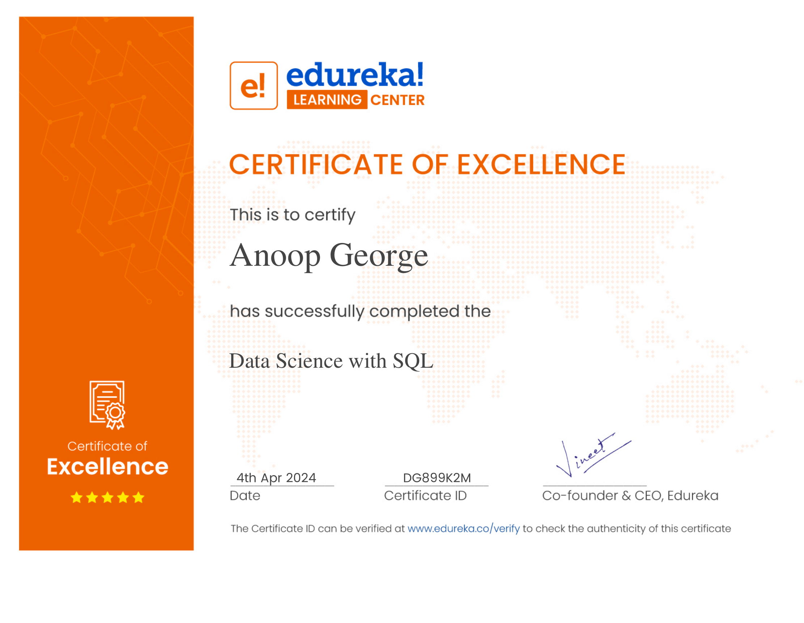
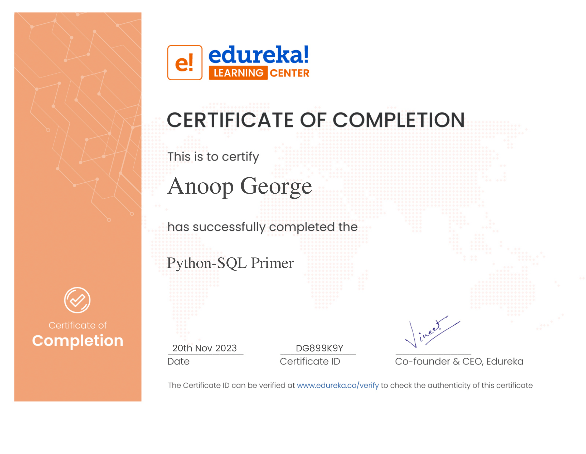

# Hi there, I'm Anoop George! 👋 

## 🚀 About Me
I'm a passionate Data Scientist fresher with a strong foundation in data analysis, machine learning, and NLP. I'm excited about using data to drive business decisions and create impactful solutions.

## 🛠️ Skills
- **Programming Languages:** Python, SQL
- **Data Analysis:** Pandas, NumPy, Matplotlib, Seaborn
- **Machine Learning:** Scikit-Learn
- **NLP:** NLTK
- **Web Scraping:** BeautifulSoup
- **Version Control:** Git, GitHub

## 🛠️ Skills and Tools

## 💼 Projects
Here are some of my notable projects:

1. **[House Price Prediction](https://github.com/AnoopGeorge418/house-price-prediction)**
   - Used Linear Regression to predict house prices based on various features.
   - Implemented data cleaning, feature engineering, and model evaluation.

2. **[Fake News Detection](https://github.com/AnoopGeorge418/fake-news-detection)**
   - Built a model to classify news articles as real or fake using NLP techniques.
   - Utilized TfidfVectorizer and PassiveAggressiveClassifier.

3. **[Movie Recommendation System](https://github.com/AnoopGeorge418/movie-recommendation-system)**
   - Created a recommendation system using collaborative filtering.
   - Implemented data preprocessing and recommendation algorithms.

## 🎓 Certifications and Achievements
- **Data Science With SQL** - Edureka Learning Center
  - 
- **Python With SQL** - Edureka Learning Center
  - 

## 📈 GitHub Stats

## 🗓️ GitHub Activity Graph

## LICENSE

## 📫 Connect with me

